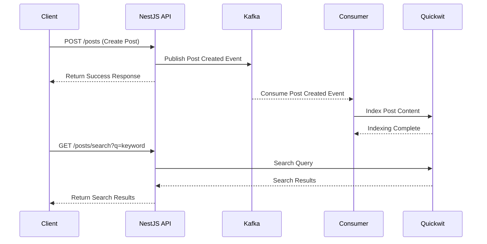

# 목적
Quickwit 검색엔진과 Kafka 이용하여 검색 기능 구현을 통한 검색엔진 테스트


# 플로우


# 실행방법

1. Kafka/Quickwit 실행: `docker compose up`
2. NestJS 서버 실행: `npm run start`

# 테스트 방법

1. 데이터 생성
```bash
curl -X POST http://localhost:3000/posts \
  -H "Content-Type: application/json" \
  -d '{
    "title": "첫 번째 게시물",
    "content": "안녕하세요, 이것은 테스트 게시물입니다."
  }'
```
2. 데이터 검색 
postman 또는 터미널을 이용하여 `http://localhost:3000/posts/search?q=테스트` 요청  
(curl 사용시 검색어를 인코딩하여 전달해야함)

# 모니터링 화면 접속
- Kafka: http://localhost:8080/ui
- Quickwit: http://localhost:7280/ui


